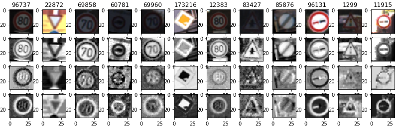
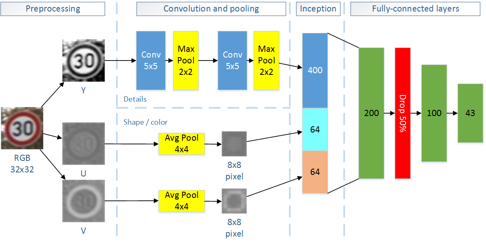

#**Traffic Sign Recognition**# 

---

**Build a Traffic Sign Recognition Project**

The goals / steps of this project are the following:

* Load the data set (see below for links to the project data set)
* Explore, summarize and visualize the data set
* Design, train and test a model architecture
* Use the model to make predictions on new images
* Analyze the softmax probabilities of the new images
* Summarize the results with a written report

[//]: # (Image References)

[image1]: ./examples/visualization.jpg "Visualization"
[image2]: ./examples/grayscale.jpg "Grayscaling"
[image3]: ./examples/random_noise.jpg "Random Noise"
[image4]: ./examples/placeholder.png "Traffic Sign 1"
[image5]: ./examples/placeholder.png "Traffic Sign 2"
[image6]: ./examples/placeholder.png "Traffic Sign 3"
[image7]: ./examples/placeholder.png "Traffic Sign 4"
[image8]: ./examples/placeholder.png "Traffic Sign 5"

## Rubric Points ###
###Here I will consider the [rubric points](https://review.udacity.com/#!/rubrics/481/view) individually and describe how I addressed each point in my implementation.  

---
###Writeup / README###

You're reading it! and here is a link to my [project code](https://github.com/cazacov/CarND-Traffic-Sign-Classifier-Project/blob/master/Traffic_Sign_Classifier.ipynb)

###Data Set Summary & Exploration###

####1. Summary ####

The data set consists of RGB images 32x32 pixels each.

I used the pandas library to calculate summary statistics of the traffic
signs data set:

* The size of training set is 34799
* The size of the validation set is 4410
* The size of test set is 12630
* The shape of a traffic sign image is 32x32 pixels, 3 RGB channels.
* The number of unique classes/labels in the data set is 43

####2. Exploration####

Here is an exploratory visualization of the data set. It is a bar chart showing how the data is distributed between image classes. The distribution is not uniform and probably represents real distribution on German streets.

###Design and Test a Model Architecture###
####1.1 Preprocessing ####
As a first strp I decided to convert images from RGB to YUV color space. The Y channel is grascale representation of the image and is useful for detection of small details. The U and V channels encode color information and help to distinguish between sign types as priority/mandatory/warning/prohibitory.

<table>
	<tr>
		<td>Source image</td><td>Y-Channel</td><td>U-Channel</td><td>V-Channel</td>
	</tr>
	<tr>
		<td></td>
		<td></td>
		<td></td>
		<td></td>
	</tr>
</table>

In grayscale image from the Y channel I then increase contrast by doing histogram correction.

As a last step I normalize values converting numbers from range [0..255] to [-1..1]. That makes learning more stable and estimation of weights deviation easier.       

####1.2 Augmented dataset ####

First training attempts have shown that the accuracy on the training images quickly reaches 99%, while the accuracy on validation dataset keeps bouncing around 90%:

> EPOCH 6 ...
Training Accuracy = 0.972 Validation Accuracy = 0.891

> EPOCH 7 ...
Training Accuracy = 0.979 Validation Accuracy = 0.910

> EPOCH 8 ...
Training Accuracy = 0.984 Validation Accuracy = 0.893

> EPOCH 9 ...
Training Accuracy = 0.991 Validation Accuracy = 0.904

This is a clear sign of overfitting when the network just rememberes training images and fails to generalize features. To make learning more stable and force the network to find general features I created more data by slightly modifying source images.

From every source image I generated another five by randomly applying the following transformations:

* Rotation [-5..+5] degrees.
* Translation [-2..+2] pixels in X and Y directions.
* Scaling [100..120] %.

That is done in Python function **transform_image**.

The final training dataset has 208794 images and looks like the following:

I did not change the image distribution between classes. 

####2. Model Architecture ####

There are two data flows through the network. 

- The grayscale image is processed in two iterations of convolution followed by pooling. These layers should detect small features of the images and make classification independent from small changes in size and position.
 
- The color channels U and V are thought to extract general information about color and the shape of the sign. That should help the neural network to quickly detect the type of sign like is it a warning (red triangle) or a mandatory sign (blue circle).
 
The outputs of feature- and color-detection data flows are then flattend and mixed in inception layer that is then   
passed to 3 fully-connected layers for the final classification.

To prevent network from overfitting there is a drop layer between fully-connected layers that randomly drops 50% of input. That forces the network to learn general features instead of simply memorizing small image details. 

 

Describe what your final model architecture looks like including model type, layers, layer sizes, connectivity, etc.) Consider including a diagram and/or table describing the final model.

My final model consisted of the following layers:

| Layer         		|     Description	        					| 
|:---------------------:|:---------------------------------------------:| 
| Input         		| 32x32x3 Y-U-V image   						|
| Input Y-Channel       | 32x32x1 Grayscale								| 
| Convolution 5x5     	| 1x1 stride, valid padding, outputs 28x28x6 	|
| RELU					|												|
| Max pooling	      	| 2x2 stride,  outputs 14x14x6  				|
| Convolution 5x5	    | 1x1 stride, valid padding, outputs 10x10x16   |
| RELU					|												|
| Max pooling	      	| 2x2 stride,  outputs 5x5x16  					|
| Input U-Channel       | 32x32x1 color									|
| Avg pooling			| 4x4 stride, downscales input to 8x8x1			|
| Input V-Channel       | 32x32x1 color									|
| Avg pooling			| 4x4 stride, downscales input to 8x8x1			|
| Inception				| Flatten and concatenate. Output 528x1			|
| Fully-connected		| 528->200 nodes								|
| RELU					|												|
| Drop					| Keep probability 50%     					    |
| Fully-connected		| 200->100 nodes								|
| RELU					|												|
| Fully-connected		| 100->43 nodes	(number of classes=				|
| Softmax				| 	        									|
| Loss-function		    | Cross-entropy + reduce mean operation			|

 
####3. Describe how you trained your model. The discussion can include the type of optimizer, the batch size, number of epochs and any hyperparameters such as learning rate.

To train the model, I used an ....

####4. Describe the approach taken for finding a solution and getting the validation set accuracy to be at least 0.93. Include in the discussion the results on the training, validation and test sets and where in the code these were calculated. Your approach may have been an iterative process, in which case, outline the steps you took to get to the final solution and why you chose those steps. Perhaps your solution involved an already well known implementation or architecture. In this case, discuss why you think the architecture is suitable for the current problem.

My final model results were:
* training set accuracy of ?
* validation set accuracy of ? 
* test set accuracy of ?

If an iterative approach was chosen:
* What was the first architecture that was tried and why was it chosen?
* What were some problems with the initial architecture?
* How was the architecture adjusted and why was it adjusted? Typical adjustments could include choosing a different model architecture, adding or taking away layers (pooling, dropout, convolution, etc), using an activation function or changing the activation function. One common justification for adjusting an architecture would be due to overfitting or underfitting. A high accuracy on the training set but low accuracy on the validation set indicates over fitting; a low accuracy on both sets indicates under fitting.
* Which parameters were tuned? How were they adjusted and why?
* What are some of the important design choices and why were they chosen? For example, why might a convolution layer work well with this problem? How might a dropout layer help with creating a successful model?

If a well known architecture was chosen:
* What architecture was chosen?
* Why did you believe it would be relevant to the traffic sign application?
* How does the final model's accuracy on the training, validation and test set provide evidence that the model is working well?
 

###Test a Model on New Images

####1. Choose five German traffic signs found on the web and provide them in the report. For each image, discuss what quality or qualities might be difficult to classify.

Here are five German traffic signs that I found on the web:

![alt text][image4] ![alt text][image5] ![alt text][image6] 
![alt text][image7] ![alt text][image8]

The first image might be difficult to classify because ...

####2. Discuss the model's predictions on these new traffic signs and compare the results to predicting on the test set. At a minimum, discuss what the predictions were, the accuracy on these new predictions, and compare the accuracy to the accuracy on the test set (OPTIONAL: Discuss the results in more detail as described in the "Stand Out Suggestions" part of the rubric).

Here are the results of the prediction:

| Image			        |     Prediction	        					| 
|:---------------------:|:---------------------------------------------:| 
| Stop Sign      		| Stop sign   									| 
| U-turn     			| U-turn 										|
| Yield					| Yield											|
| 100 km/h	      		| Bumpy Road					 				|
| Slippery Road			| Slippery Road      							|

The model was able to correctly guess 4 of the 5 traffic signs, which gives an accuracy of 80%. This compares favorably to the accuracy on the test set of ...

####3. Describe how certain the model is when predicting on each of the five new images by looking at the softmax probabilities for each prediction. Provide the top 5 softmax probabilities for each image along with the sign type of each probability. (OPTIONAL: as described in the "Stand Out Suggestions" part of the rubric, visualizations can also be provided such as bar charts)

The code for making predictions on my final model is located in the 11th cell of the Ipython notebook.

For the first image, the model is relatively sure that this is a stop sign (probability of 0.6), and the image does contain a stop sign. The top five soft max probabilities were

| Probability         	|     Prediction	        					| 
|:---------------------:|:---------------------------------------------:| 
| .60         			| Stop sign   									| 
| .20     				| U-turn 										|
| .05					| Yield											|
| .04	      			| Bumpy Road					 				|
| .01				    | Slippery Road      							|

For the second image ... 

### (Optional) Visualizing the Neural Network (See Step 4 of the Ipython notebook for more details)
####1. Discuss the visual output of your trained network's feature maps. What characteristics did the neural network use to make classifications?

