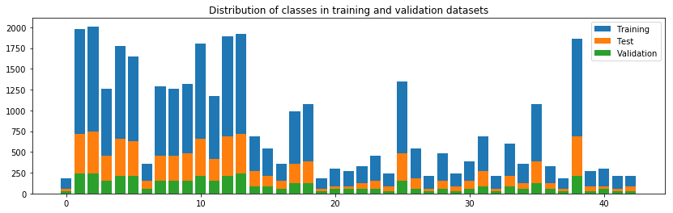
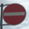
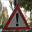
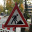
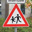
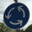

# Traffic Sign Recognition # 

---

**Build a Traffic Sign Recognition Project**

The goals / steps of this project are the following:

* Load the data set (see below for links to the project data set)
* Explore, summarize and visualize the data set
* Design, train and test a model architecture
* Use the model to make predictions on new images
* Analyze the softmax probabilities of the new images
* Summarize the results with a written report

## Rubric Points ###
Here I will consider the [rubric points](https://review.udacity.com/#!/rubrics/481/view) individually and describe how I addressed each point in my implementation.  

---
### Writeup / README ###

You're reading it! and here is a link to my [project code](https://github.com/cazacov/CarND-Traffic-Sign-Classifier-Project/blob/master/Traffic_Sign_Classifier.ipynb)

### Data Set Summary & Exploration ###

#### 1. Summary ####

The data set consists of RGB images 32x32 pixels each.

I used the pandas library to calculate summary statistics of the traffic
signs data set:

* The size of training set is 34799
* The size of the validation set is 4410
* The size of test set is 12630
* The shape of a traffic sign image is 32x32 pixels, 3 RGB channels.
* The number of unique classes/labels in the data set is 43

#### 2. Exploration ####

Here is an exploratory visualization of the data set. It is a bar chart showing how the data is distributed between image classes. The distribution is not uniform and probably represents real distribution on German streets.

### Design and Test a Model Architecture ###
#### 1.1 Preprocessing ####
As a first strp I decided to convert images from RGB to YUV color space. The Y channel is grascale representation of the image and is useful for detection of small details. The U and V channels encode color information and help to distinguish between sign types as priority/mandatory/warning/prohibitory.

<table>
	<tr>
		<td>Source image</td><td>Y-Channel</td><td>U-Channel</td><td>V-Channel</td>
	</tr>
	<tr>
		<td></td>
		<td></td>
		<td></td>
		<td></td>
	</tr>
</table>

In grayscale image from the Y channel I then increase contrast by doing histogram correction.

As a last step I normalize values converting numbers from range [0..255] to [-1..1]. That makes learning more stable and estimation of weights deviation easier.       

#### 1.2 Augmented dataset ####

First training attempts have shown that the accuracy on the training images quickly reaches 99%, while the accuracy on validation dataset keeps bouncing around 90%:

> EPOCH 6 ...
Training Accuracy = 0.972 Validation Accuracy = 0.891

> EPOCH 7 ...
Training Accuracy = 0.979 Validation Accuracy = 0.910

> EPOCH 8 ...
Training Accuracy = 0.984 Validation Accuracy = 0.893

> EPOCH 9 ...
Training Accuracy = 0.991 Validation Accuracy = 0.904

This is a clear sign of overfitting when the network just rememberes training images and fails to generalize features. To make learning more stable and force the network to find general features I created more data by slightly modifying source images.

From every source image I generated another five by randomly applying the following transformations:

* Rotation [-5..+5] degrees.
* Translation [-2..+2] pixels in X and Y directions.
* Scaling [100..120] %.

That is done in Python function **transform_image**.

The final training dataset has 208794 images and looks like the following:

I did not change the image distribution between classes. 

#### 2. Model Architecture ####

There are two data flows through the network. 

- The grayscale image is processed in two iterations of convolution followed by pooling. These layers should detect small features of the images and make classification independent from small changes in size and position.
 
- The color channels U and V are thought to extract general information about color and the shape of the sign. That should help the neural network to quickly detect the type of sign like is it a warning (red triangle) or a mandatory sign (blue circle).
 
The outputs of feature- and color-detection data flows are then flattend and mixed in inception layer that is then   
passed to 3 fully-connected layers for the final classification.

To prevent network from overfitting there is a drop layer between fully-connected layers that randomly drops 50% of input. That forces the network to learn general features instead of simply memorizing small image details. 

 

Describe what your final model architecture looks like including model type, layers, layer sizes, connectivity, etc.) Consider including a diagram and/or table describing the final model.

My final model consisted of the following layers:

| Layer         		|     Description	        					| 
|---------------------|---------------------------------------------| 
|Input         		|32x32x3 Y-U-V image   						|
|Input Y-Channel       |32x32x1 Grayscale								| 
|Convolution 5x5     	|1x1 stride, valid padding, outputs 28x28x6 	|
|RELU					|												|
|Max pooling	      	|2x2 stride,  outputs 14x14x6  				|
|Convolution 5x5	    |1x1 stride, valid padding, outputs 10x10x16   |
|RELU					|												|
|Max pooling	      	|2x2 stride,  outputs 5x5x16  					|
|Input U-Channel       |32x32x1 color									|
|Avg pooling			|4x4 stride, downscales input to 8x8x1			|
|Input V-Channel       |32x32x1 color									|
|Avg pooling			|4x4 stride, downscales input to 8x8x1			|
|Inception				|Flatten and concatenate. Output 528x1			|
|Fully-connected		|528->200 nodes								|
|RELU					|												|
|Drop					|Keep probability 50%     					    |
|Fully-connected		|200->100 nodes								|
|RELU					|												|
|Fully-connected		|100->43 nodes	(number of classes=				|
|Softmax				| 	        									|

 
####3. Describe how you trained your model. The discussion can include the type of optimizer, the batch size, number of epochs and any hyperparameters such as learning rate.

To train the model, I used reduce-mean operation on cross-entropy as the cost function. The reference LeNet-5 implementation uses hard-coded mean deviation for initial values of weights, I replaced it with the inverse sqaure root of weights count as recomended in DeepLearning Nanodegree.

The training is done with batch size 128 in 25 epochs. After 20 epochs the error curve si getting flat and further culculations do not improve  accuracy that much. 

 

The network is still overfitting a bit and should be trained on a bigger dataset. 

The Adam optimizer works pretty well. After 25 epochs the network reaches accuracy of about 95%.

####4. Describe the approach taken for finding a solution and getting the validation set accuracy to be at least 0.93. Include in the discussion the results on the training, validation and test sets and where in the code these were calculated. Your approach may have been an iterative process, in which case, outline the steps you took to get to the final solution and why you chose those steps. Perhaps your solution involved an already well known implementation or architecture. In this case, discuss why you think the architecture is suitable for the current problem.

My final model results were:
* training set accuracy of 98.1%
* validation set accuracy of 95.2% 
* test set accuracy 12045 of 12630 = 95.4%

If an iterative approach was chosen:
* As starting point I took the LeNet-5 architecture
* That architecure has accuracy about 88-90% on the German Trafic Signs Dataset.
* To improve the accuracy I splited images in Y-U-V channels. The Y (grascale) channel is used for small detail detecion, while color channels U and V help the network to capture color and shape of an image.   
* Increasing contrast of the Y channel also improved the accuracy.
* The network showed great accuracy >99% on training dataset, but only 90% on the validation images. That means it just "rememebered" training images.   
* To reduce overfitting I added drop layer with keep probability of 50%. That improved the accuracy on the validation dataset. Probability values over 70% do not regulaize the model enough and drop more then half of values makes learining much slower.
* Further I decided to generate more training images by slightly modifing existing ones.
* The convolution layers were forced to "learn" the structure of signs and do not focus on exact location of features.  
* Other fine tuning was increasing the nuber of epochs to 25. I was using GPU instance in AWS cloud and was still able to run full training in less than 5 minutes.
* Finally I got accuracy of 95%. The model is still overfitting a bit, and probably needs to be trained with more real data.
* I think the most important architecture decision was to have two data flows: one for detail detection and one for color/shape detection and mix them in the inception layer. 
* Further improvement could be batch normalization of conv layer outputs and using **leaky** ReLU activation as I did in Image Classification project in DeepLearining nanodegree. 
 

###Test a Model on New Images

#### 1. Real images ####

I am living in Germany, so I just went outside and made photos of 20 real signs:

<table>
	<tr>
		<td></td>
		<td></td>
		<td></td>
		<td></td>
		<td></td>
	</tr>
	<tr>
		<td></td>
		<td></td>
		<td></td>
		<td></td>
		<td></td>
	</tr>
	<tr>
		<td></td>
		<td></td>
		<td></td>
		<td></td>
		<td></td>
	</tr>
	<tr>
		<td></td>
		<td></td>
		<td></td>
		<td></td>
		<td></td>
	</tr>
</table>

The most interesting images are the following:

The stop sign is hanging pretty high and I made the photo from the ground level. The sign on the picture has oval shape and is squeezed vertically.

The second group of signs that can be hard to identify are the warning signs. Downscaled to 32x32 pixels they all look same like "a red triangle with some vertical noisy structure in the middle"

<table>
	<tr>
		<td></td>
		<td></td>
		<td></td>
		<td></td>
		<td></td>
	</tr>
</table>

#### 2. Model predictions #####

Here are the results of the prediction:

| Image			        | Best prediction	        					| Second candidate |
|---------------------|---------------------------------------------|---------------------------------------------| 
| Speed limit (30km/h) | Speed limit (30km/h) 99.999% | Speed limit (50km/h)  0.000% |
| Speed limit (50km/h) | Speed limit (50km/h) 100.000% | Speed limit (30km/h)  0.000% |
| Speed limit (70km/h) | Speed limit (70km/h) 100.000% | Speed limit (20km/h)  0.000% |
| No passing | No passing 100.000% | No passing for vehicles over 3.5 metric tons  0.000% |
| Right-of-way at the next intersection | Right-of-way at the next intersection 100.000% | Pedestrians  0.000% |
| Priority road | Priority road 100.000% | No entry  0.000% |
| Yield | Yield 100.000% | No vehicles  0.000% |
| Stop | Stop 100.000% | Yield  0.000% |
| No entry | No entry 100.000% | Stop  0.000% |
| General caution | General caution 100.000% | Pedestrians  0.000% |
| Road narrows on the right | **Road narrows on the right 99.997%** | Pedestrians  0.002% |
| Road work | Road work 100.000% | Bumpy road  0.000% |
| Traffic signals | **Traffic signals 90.489%** | General caution  9.511% |
| Children crossing | Children crossing 100.000% | Bicycles crossing  0.000% |
| Bicycles crossing | **Bicycles crossing 99.767%** | Children crossing  0.233% |
| Turn right ahead | Turn right ahead 100.000% | Ahead only  0.000% |
| Go straight or right | Go straight or right 100.000% | Ahead only  0.000% |
| Keep right | Keep right 100.000% | Turn left ahead  0.000% |
| Roundabout mandatory | Roundabout mandatory 100.000% | Go straight or left  0.000% |
| End of no passing | End of no passing 99.998% | End of all speed and passing limits  0.002% |

The model was able to correctly guess 20 of the 20 real traffic signs, which gives an accuracy of 100%. Probably it's because I made photos in the middle of a cloudy day and there are no contrast shadows that could distort the shape. The lighting conditions were almost perfect.

The model was not absolutelly sure with the sign "Trafic signals" that was predicted correctly, but the next candidate "General caution" also has non-zero score. As expected, the model has some difficulties with the similar looking warning signs.

#### 3. Top 5 predictions for every real image ####

